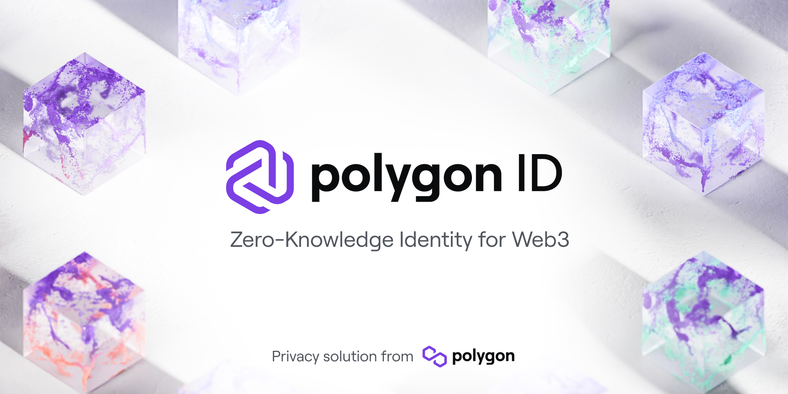

# BI\*\*H YOUR COMPANY!

## Overview

This project offers a decentralized, anonymous forum for discussing workspace issues. Leveraging advanced technologies, it provides a safe environment for users to share experiences related to their workspace without compromising their privacy or identity.

## Key Features

- **Decentralized Data Storage**: Powered by IPFS and Lighthouse for secure, robust data management.
- **Private Communication**: Uses the Waku protocol for encrypted, decentralized interactions.
- **Anonymous Verification**: Integrates Polygon ID for selective credential disclosure, maintaining user anonymity.
- **Data Integrity**: Employs zero-knowledge proofs for securely handling company names in user posts.
- **Open Discussion Platform**: Facilitates candid, anonymous discussions on workplace matters like salaries, whistleblowing, etc.
- **Censorship-Resistant Environment**: Ensures a secure platform for unrestricted discussions.

## Installation Guidelines

- Clone the repository

  ```shell
  git clone https://github.com/xritzx/whisperCorp.git
  ```

- Install dependencies

  ```shell
  yarn
  ```

- Add environment variables

  - Create a `.env` file in the `packages/nextjs` directory and fill the required fields

    ```shell
    cp packages/nextjs/.env.example packages/nextjs/.env
    ```

  - Create a `.env` file in the `packages/server` directory and fill the required fields

    ```shell
    cp packages/server/.env.example packages/server/.env
    ```

- Run the verifier backend server. You will also need to install ngrok for this. See [this](https://ngrok.com/download) for more information. After installing ngrok, run the following command to start the server.

  ```shell
  ngrok http 8080
  ```

  Add the ngrok URL to the `HOSTED_SERVER_URL` field in the `.env` file in the `packages/server` directory.
  Run the following command to start the server.

  ```shell
  yarn start:server
  ```

- Run the frontend server. You will also need to install the Polygon ID mobile app for this. See [this](https://devs.polygonid.com/docs/wallet/wallet-sdk/polygonid-app/) for more information.

  ```shell
  yarn start:next
  ```

## Contributing

This project, initiated at [ETHIndia23 hackathon](https://ethindia.co/), is open for contributions. See our contributing guidelines for more information.

## License

This project is released under the [MIT License](LICENSE.md), permitting free use while providing necessary legal protections.

## Acknowledgements and References

[](https://waku.org/)
[](https://polygonid.com/)
[](https://www.lighthouse.storage/)
[](https://ipfs.tech/)

## Contributors

Reach out to us for inquiries:

- [Debjit Datta](https://github.com/debjitdbb/)
- [Ritankar Paul](https://github.com/xritzx/)
- [Sumit Guha](https://github.com/sumit03guha)
